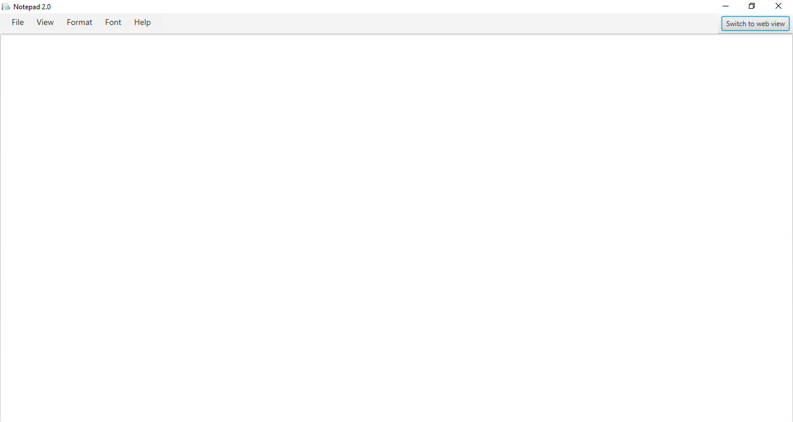
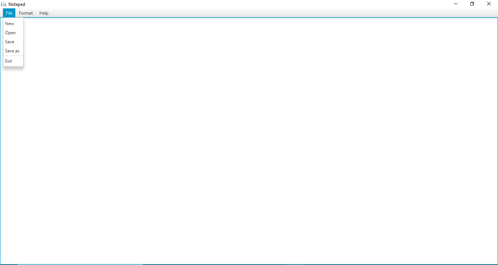
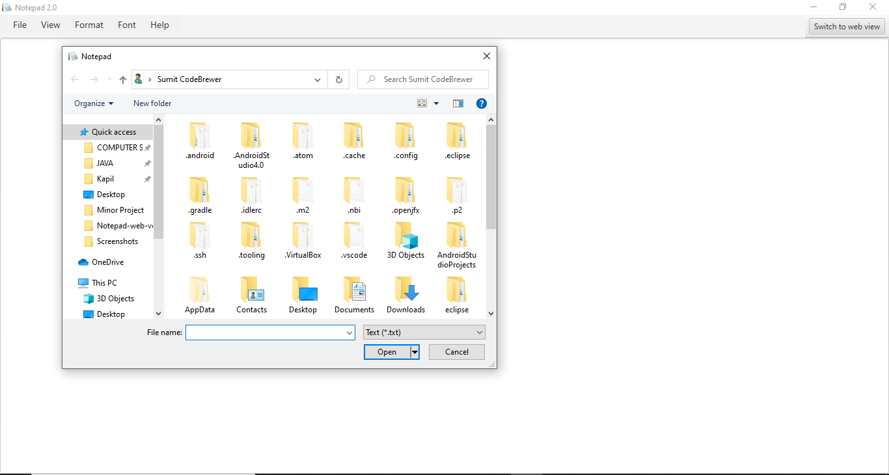
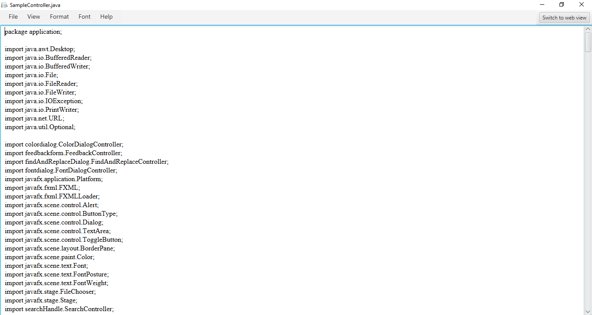
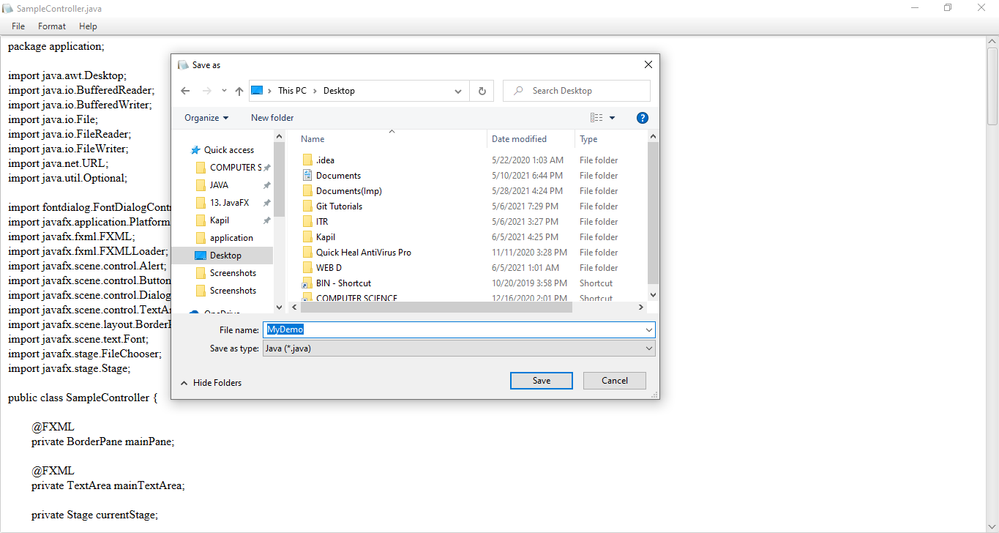
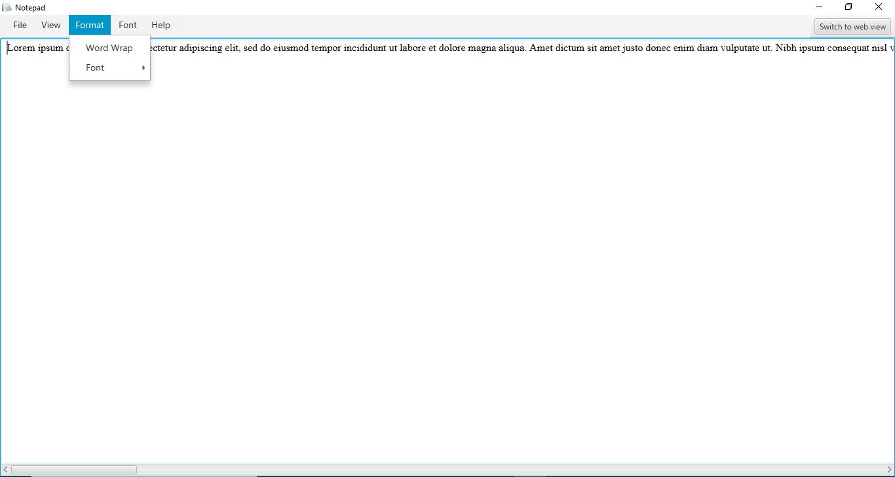
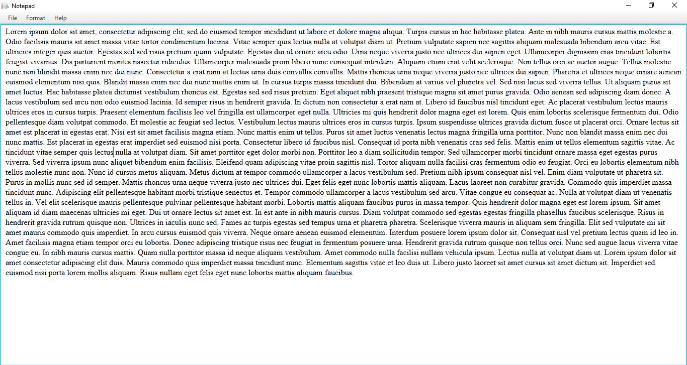
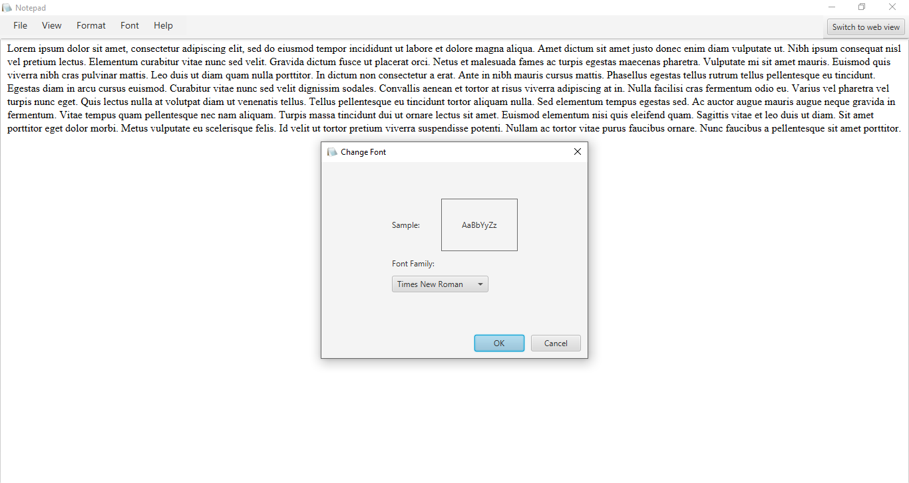
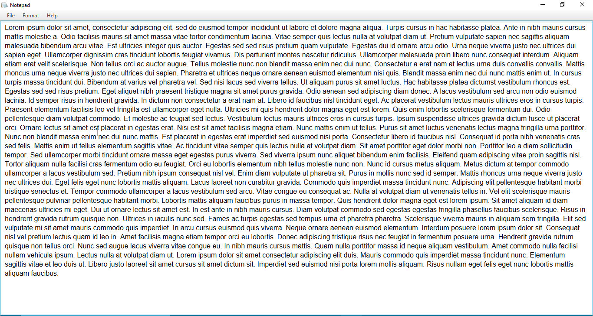

# Notepad :wave:

This is a simple notepad application created in Java using JavaFx-11.

 

### Features
<ul>
    <li>Create a new file.
    <li>Edit an existing file.
    <li>Select font family.
    <li>Save the file at current location or save as it with new name.
</ul>

---

## Screenshots

### Main View

 

### File Options

 

### Open a File

 

### Opened a File

 

### Save as Option

 

### No WordWrap

 

### WordWrap

 

### Change Font

 

### Changed Font (Times New Roman-->Arial)

